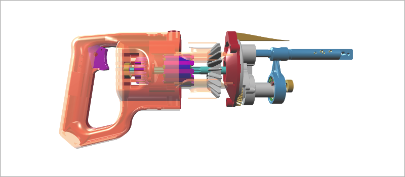

# Introduction

#### [xeometry](http://xeolabs.com/xeometry) is an open source JavaScript API for viewing glTF models on WebGL.

A xeometry [Viewer](http://xeolabs.com/xeometry/docs/#viewer) is a single class that wraps the [xeogl](http://xeogl.org) 3D engine in a set of simple data-driven methods that focus on loading glTF models and manipulating scene elements to create cool 3D presentations.

The example below shows the basic idea of how to use xeometry. In this example, we're creating a viewer, positioning its camera, loading a model of a reciprocating saw, rotating the model so we can see it from the side, then making the handle objects transparent, to reveal the inner workings.

```javascript
var viewer = new xeometry.Viewer();

viewer.setEye([-145.22, -32.97, 282.5]);
viewer.setLook([-147.68, -20.64, 0]);
viewer.setUp([0, 1, 0]);

viewer.loadModel("saw", "ReciprocatingSaw.gltf", function () {
    viewer.setRotate("saw", [90, 0, 0]);
    viewer.setOpacity(["saw#1", "saw#1.28", "saw#1.1"], 0.3);
});
```

[](http://xeolabs.com/xeometry/examples/#guidebook_transparency)

Once we've tweaked everything to our heart's content, we can save the viewer to a JSON bookmark.

```javascript
var bookmark = viewer.getBookmark();
```

We can then load that bookmark again, perhaps even into a different viewer instance, to exactly restore that view \(see [_Viewer Bookmarks_](viewerBookmarks.md) for more info\).

```javascript
var viewer2 = new xeometry.Viewer();
viewer2.setBookmark(bookmark, function() { /* Loaded */ });
```

See [Features](/features.md) for an overview of all the things that you can do through the xeometry API.

