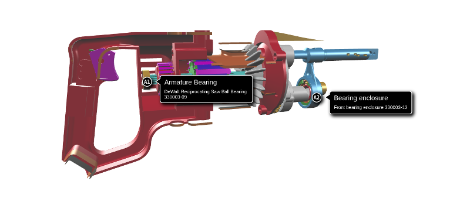

# Annotations

Annotations are labels that you can pin on the objects in your viewer.

Each annotation is displayed as pin, which contains a 1-2 character string, called a "glyph", and a label attached to the pin, which contains a title and a description. You can show and hide the pin and label independently.

#### Positioning

An annotation's pin is positioned within a triangle of its object's geometry. The object is indicated by its ID, the triangle is indicated by the index of its first element within the geometry indices array, and the position within the triangle is indicated using barycentric coordinates. See [_Querying Geometry_](queryingGeometry.md) for more information on object geometries.

#### Occlusion culling

By default, an annotation's pin and label will become invisible whenever the pin is occluded by other objects in the 3D view. This is called _occlusion culling_ and you can disable that for each annotation individually, whenever you need them to remain visible when behind or inside things.

#### Camera position

An annotation can be configured with a suggested camera position from which to view it. This is optional, and is given as camera _eye_, _look_ and _up_ vectors \(see [_Controlling the camera_](controllingTheCamera.md)\).

#### Customizing appearance

Annotations are rendered as HTML elements and have CSS rules that you  can redefine to customize their appearance. As a guide, refer to their [default CSS stylesheet](https://github.com/xeolabs/xeometry/blob/master/libs/xeogl/annotations/annotation-style.js).

Annotations are completely editable through the viewer API. You can move them to different objects and triangles, edit their labels, and so on.

### Examples

In the example below, we'll position the camera and load a glTF model of a reciprocating saw. When the model has loaded, we'll rotate it so that we can see it from the side. Then we'll hide a couple of cover objects so that we can see the armature bearing, which is normally hidden inside the cover. Finally, we'll create annotations on the armature bearing and one of the bearing enclosures. We'll configure our annotations to show their pins and labels, and to be hidden whenever their pins are hidden behind objects in the 3D view.

```javascript
var viewer = new xeometry.Viewer();

viewer.setEye([-296.56, 26.78, 300.49]);
viewer.setLook([-130, -40, 0]);
viewer.getUp([0.09, 0.98, -0.16]);

viewer.loadModel("saw", "ReciprocatingSaw.gltf", function () {

    viewer.setRotate("saw", [90, 0, 0]);

    viewer.hide(["saw#3.1", "saw#3.2"]);

    viewer.createAnnotation("a1", {
        object: "saw#3.32",
        primIndex: 3303,
        bary: [0.3333, 0.3333, 0.3333],
        glyph: "A1",
        title: "Armature Bearing",
        desc: "DeWalt Reciprocating Saw Ball Bearing 330003-09",
        eye: [-254.21, -20.34, 49.75],
        look: [-213.19, -20.63, -0.00],
        up: [-0.36, 0.81, 0.44],
        pinShown: true,
        labelShown: true,
        occludable: true
    });

    viewer.createAnnotation("a2", {
        primIndex: 11532,
        bary: [0.3333, 0.3333, 0.3333],
        glyph: "A2",
        title: "Bearing enclosure",
        desc: "Front bearing enclosure 330003-12",
        object: "saw#3.94",
        eye: [-107.94, -31.69, 101.03],
        look: [-103.53, -20.64, 0],
        up: [-0.03, 0.75, 0.66],
        pinShown: true,
        labelShown: true,
        occludable: true
    });
});
```

[](http://xeolabs.com/xeometry/examples/#guidebook_annotations)

