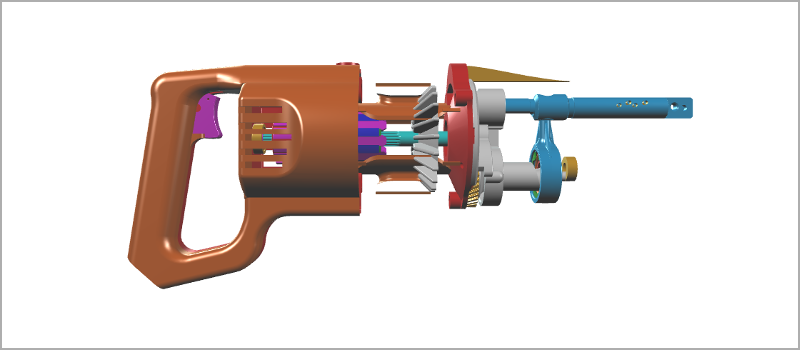
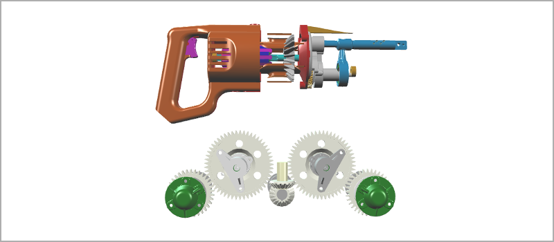
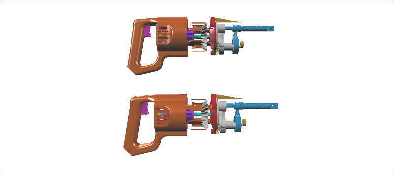

# Loading Models

glTF 2.0 models are xeometry's unit of content. You can load multiple models into a [Viewer](http://xeolabs.com/xeometry/docs/#viewer) at the same time, as well as multiple copies of the same models. You can then manipulate the appearance of each model as a unit, or manipulate each of its objects individually.

xeometry only loads glTF 2.0 geometries, materials and transforms. It does not \(yet\) load animations, cameras or lights.

When you load a model, you assign it a unique ID so that you can find it within the viewer. That ID will get prefixed to the IDs of the model's objects. This allows two or more copies of the same model to be loaded at the same time, without ID clashes between their objects. See [_Querying Models and Objects_](queryingModelsAndObjects.md) for more info on querying objects within your models.

### Examples

Loading a model into a viewer:

```javascript
viewer.loadModel("saw", "./Reciprocating_Saw.gltf", function () {
    // Loaded
});
```

[](http://xeolabs.com/xeometry/examples/#loading_loadModel)

Loading two separate models into a viewer:

```javascript
viewer.loadModel("saw", "./Reciprocating_Saw.gltf", function () {
    // Loaded
 });

viewer.loadModel("gearbox", "./GearboxAssy.gltf", function () {
    // Loaded
});
```

[](http://xeolabs.com/xeometry/examples/#loading_loadTwoModels)

Loading two copies of the same model into a viewer:

```javascript
viewer.loadModel("saw1", "./Reciprocating_Saw.gltf",  function () {
    // Loaded
});

viewer.loadModel("saw2", "./Reciprocating_Saw.gltf",  function () {
    // Loaded
});
```

[](http://xeolabs.com/xeometry/examples/#loading_sameModelTwice)

Unloading a model:

```javascript
viewer.unloadModel("gearbox");
```

Clearing everything from the viewer:

```javascript
viewer.clear();
```

#### Other things you can do with models

Hide and show a model \(see [_Visibility_](visibility.md)\):

```javascript
viewer.hide("gearbox");
viewer.show("gearbox");
```

Fly the camera to look at a model \(see [_Fitting things in view_](fittingThingsInView.md)\):

```javascript
viewer.viewFit("gearbox", function() {
    // Camera arrived
});
```

Get IDs of all models currently loaded \(see [_Querying Models and Objects_](queryingModelsAndObjects.md)\):

```javascript
var models = viewer.getModels();
```

Get IDs of objects in a model \(see [_Querying Models and Objects_](queryingModelsAndObjects.md)\):

```javascript
var saw = viewer.getObjects("gearbox");
```

Get the World-space boundary of a model \(see [_Querying Boundaries_](queryingBoundaries.md)\):

```javascript
var saw = viewer.getObjects("gearbox");
```

Transform a model \(see [_Transforming_](transforming.md)\):

```javascript
viewer.setTranslate("gearbox", [100,0,0]);
viewer.setScale("gearbox", [0.5,0.5,0.5]);
viewer.setRotate("gearbox", [90,0,0]);
```


