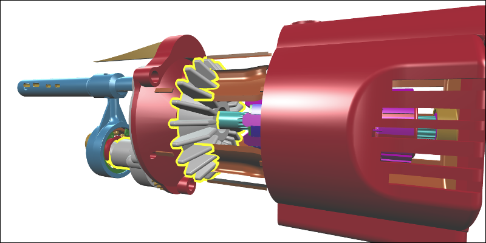

# Outlining objects

You can emphasize objects in your viewer by displaying outlines around them.

[](http://xeolabs.com/xeometry/examples/#effects_outlining)

````javascript
var viewer = new xeometry.Viewer();

viewer.loadModel("gearbox", "GearboxAssy.gltf", function () {

    viewer.viewFit();

    viewer.setOutlineColor([1, 1, 0]);
    viewer.setOutlineThickness(8);

    viewer.showOutline([
        "gearbox#1", "gearbox#1.0", "gearbox#1.1", "gearbox#1.2" // ...
    ]);
});
````

Outlining everything in a viewer:

```javascript
viewer.showOutline();
```

Outlining all objects in a model:

```javascript
viewer.hideOutline();
viewer.showOutline("saw");
```

Outline given objects:

```javascript
viewer.hideOutline();
viewer.showOutline(["saw#1", "saw#5"]);
```

Outline objects of the given types (see [Assigning types to objects](assigningTypesToObjects.md)):

```javascript
viewer.hideOutline();
viewer.showOutline(["IfcFlowController", "IfcFlowFitting"]);
```

