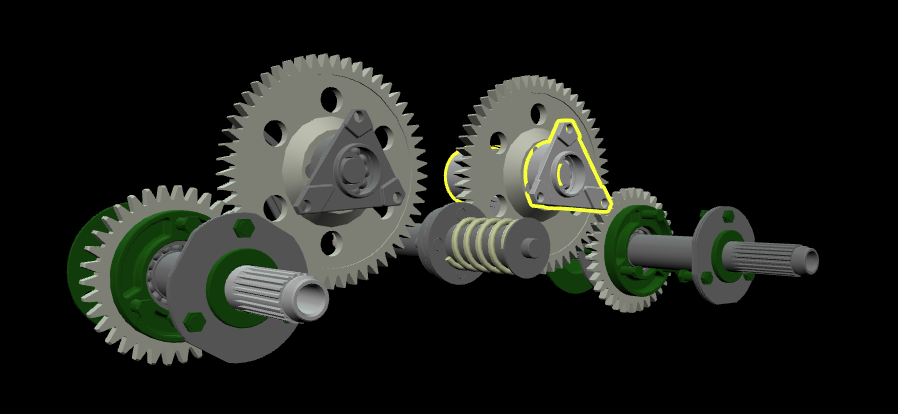

# Outlining

You can emphasize objects in your viewer by displaying outlines around them.

### Example

In the example below, we'll position the camera and configure the appearance of outlines. Then we'll load a glTF model of a reciprocating saw. When that's loaded, we'll show outlines around three objects in the saw.

```javascript
var viewer = new xeometry.Viewer();

viewer.setEye([-130, -40, 350]);
viewer.setLook([-130, -40, 0]);

viewer.setOutlineColor([1, 1, 0]);
viewer.setOutlineThickness(8);

viewer.loadModel("gearbox", "GearboxAssy.gltf", function () {
    viewer.showOutline(["gearbox#1", "gearbox#1.0", "gearbox#1.1"]);
});
```

[](http://xeolabs.com/xeometry/examples/#guidebook_outlining)

### More examples

Outlining all objects in a given model:

```javascript
viewer.hideOutline();
viewer.showOutline("saw");
```

Outlining all objects of the given types \(see [_Assigning types to objects_](assigningTypesToObjects.md)\):

```javascript
viewer.hideOutline();
viewer.showOutline(["IfcFlowController", "IfcFlowFitting"]);
```


