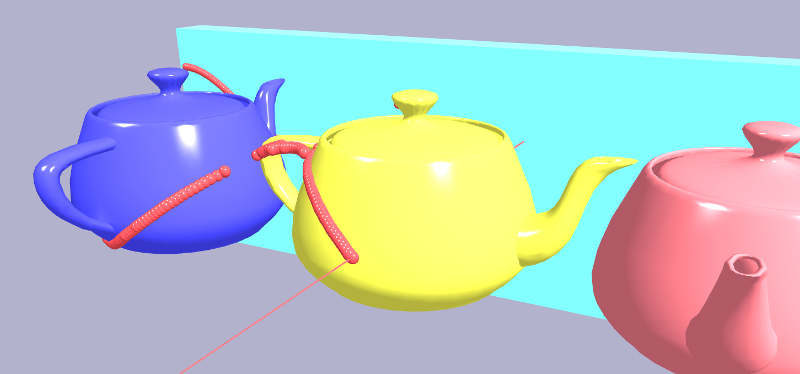

# Picking

TODO: definition of picking



xeometry supports four types of picking:

1. pick object at canvas coordinates,
2. pick point on object surface at canvas coordinates,
3. pick object with World-space ray, and
4. pick point on object surface with World-space ray.

Types 1 and 3 just return the ID of the picked object.

Types 2 and 4 return the picked object, as well as information about the surface intersection, which includes:

* the triangle,
* barycentric coordinates within the triangle,
* World space coordinates,
* View space coordinates,
* normal vector, and
* UV coordinates.

Note that we'll only get a normal if the object's geometry has normals, and UV coordinates if the geometry has UVs. xeometry finds the values for these by interpolating within the values for the triangle vertices using the barycentric coordinates.

> _**Under the hood:** this article explains the picking algorithms used in xeogl \(xeometry's underlying WebGL engine\): _[_http://xeolabs.com/articles/xeogl-picking_](http://xeolabs.com/articles/xeogl-picking)

## Picking an object at canvas coordinates

This type of picking is the simplest: we pick the closest object behind the given canvas coordinates. This is equivalent to firing a ray through the canvas, down the negative Z-axis, to find the first object it hits.


#### **Examples**

Draw outline around each clicked object \(see [Outlining Objects](outlining.md)\):

```javascript
viewer.getOverlay().addMouseEventListener("mouseclick", function(e) {
    var hit = viewer.pickObject([e.x, e.y]);
    if (hit) {
        var objectId = hit.id;
        viewer.showOutline(objectId);
    }
});
```

Hide each clicked object \(see [Visibility](visibility.md)\):

```javascript
viewer.getOverlay().addMouseEventListener("mouseclick", function(e) {
    var hit = viewer.pickObject([e.x, e.y]);
    if (hit) {
        var objectId = hit.id;
        viewer.showOutline(objectId);
    }
});
```

Fit camera view to each clicked object \(see [Fitting Things in View](fittingThingsInView.md)\):

```javascript
viewer.getOverlay().addMouseEventListener("mouseclick", function(e) {
    var hit = viewer.pickObject([e.x, e.y]);
    if (hit) {
        var objectId = hit.id;
        viewer.viewFit(objectId);
    }
});
```

## Picking point on object surface at canvas coords

Like the previous type of picking, this one also picks the closest object behind the given canvas coordinates, but also gets geometric information about the point on the object's surface that lies right behind those canvas coordinates.


#### **Example**

Annotate an object by clicking on it \(see [Creating Annotations](annotations.md)\):

```javascript
viewer.getOverlay().addMouseEventListener("mouseclick", function(e) {
    var hit = viewer.pickSurface([e.x, e.y]);
    if (hit) {
        viewer.createAnnotation("annot_" + Date.now(), { // Ensure 'unique' ID
            objectId: hit.id,
            primIndex: hit.primIndex,
            bary: hit.bary,
            glyph: "A1",
            title: "My annotation",
            desc: "Description of the annotation",
            eye: viewer.getEye(),
            look: viewer.getLook(),
            up: viewer.getUp(),
            occludable: true
            pinShown: true,
            labelShown: true
        });
    }
});
```

## Picking object with World-space ray

For this type of picking, xeometry fires a ray through the scene, in World-space, to pick the first entity it hits.


#### Example

Firing a ray through World space to outline the first object that intersects it \(see [Outlining Objects](outlining.md)\):

```javascript
var hit = viewer.rayCastObject([0,0,-100], [0,0,1]); // Origin, dir
if (hit) {
    var objectId = hit.id;
    viewer.showOutline(objectId);
}
```

## Pick point on object surface with World-space ray

Like the previous type of picking, this one also involves firing a ray through the scene in World-space, to pick an object, but this time we're also getting geometric information about the intersection of the ray with the entity surface.

#### 

#### **Example**

Getting object and surface intersection with a World-space ray:

```javascript
hit = viewer.rayCastSurface([0,0,-100], [0,0,1]); // Origin, dir
if (hit) {
    var worldPos = hit.worldPos;
    console.log("object raycasted: " + hit.id);
    console.log("surface coordinates: "
        + worldPos[0] + "," + worldPos[1] + "," + worldPos[2]);
}
```

## Making things unpickable

Sometimes we want to be able to pick _through_ things, like windows. We can do this by setting objects unpickable.

#### Examples

Making a couple of objects unpickable:

```javascript
viewer.setUnpickable(["gearbox#1", "gearbox#1"]);
```

Making a whole model unpickable:

```javascript
viewer.setUnpickable("gearbox");
```

Making objects of given types unpickable \(in this case IFC windows and spaces\):

```javascript
viewer.setUnpickable(["IfcWindow", "IfcSpace]);
```


