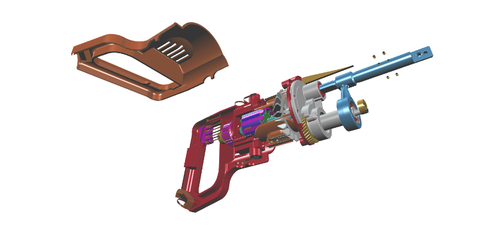

## Transforming

You can independently transform each model and object in your viewer. 

A transform consists of the following operations, applied in this order:

1. scale
2. X-axis rotation \(degrees\),
3. Y-axis rotation,
4. Z-axis rotation
5. translation

An object's transform is relative to its model's transform.

Transforming an object will dynamically update its boundary and geometry vertex positions. Transforming a model will  
dynamically update its boundary, along with the boundary and geometry vertex positions of each of its objects \(see [_Querying Boundaries_](queryingBoundaries.md) and [_Querying Geometry_](queryingGeometry.md)\).

### Example

In the example below, we'll load a glTF model of a reciprocating saw. Then we rotate the saw 90 degrees about its local X axis, so that we see it from the side. Finally, we translate and rotate a cover object,  away from the saw, to reveal the saw's inner objects.

```javascript
var viewer = new xeometry.Viewer();

viewer.setEye([53.06, -198.07, 302.47]);
viewer.setLook([-110.88, -24.57, 87.87]);
viewer.setUp([0.38, 0.76, 0.50]);

viewer.loadModel("saw", "ReciprocatingSaw.gltf", function () {
    viewer.setRotate("saw", [90, 0, 0]);
    viewer.setTranslate("saw#3.1", [0, 80, -50]);
    viewer.setRotate("saw#3.1", [-90, 0, 0]);
});
```

[](http://xeolabs.com/xeometry/examples/#guidebook_transforming)

### More examples

Translating a model along the X axis, scale it, then rotate it 90 degrees about its X-axis:

```javascript
viewer.setTranslate("saw", [100,0,0]);
viewer.setScale("saw", [0.5,0.5,0.5]);
viewer.setRotate("saw", [90,0,0]);
```

Spinning an object about its Y-axis:

```javascript
var angles =[0,0,0]; // Tait-Bryant angles about X, Y and Z, in degrees
function spin() {
    viewer.setRotate("saw#3.1", angles);
    angles[1] += 0.1;
    requestAnimationFrame(spin);
}
spin();
```

Getting a model's translation, scale and rotation:

```javascript
var translate = viewer.getTranslate("saw");
var scale = viewer.getScale("saw");
var rotate = viewer.getRotate("saw");
```

Getting an object's translation, scale and rotation:

```javascript
var translate = viewer.getTranslate("saw#3.1");
var scale = viewer.getScale("saw#3.1");
var rotate = viewer.getRotate("saw#3.1");
```


