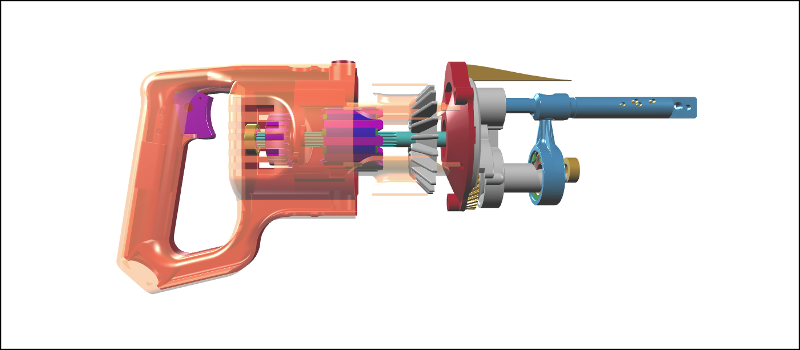

# Viewer bookmarks

You can save the state of your viewer to a JSON bookmark, which captures the complete runtime state of your viewer. When you
load the bookmark again (perhaps even into a different viewer), it will exactly restore the viewer to that state.

The bookmark will save everything, including:

* models loaded,
* object visibilities, opacities, outlines and types
* model and object transforms
* camera position and projection
* annotations, clipping planes, light sources
* etc.

### Example

To see how bookmarking works, we'll reuse the example from *[Introduction](introduction.md)* below. In this example, we're
positioning the camera, loading a model, rotating the model, and making some objects transparent, to reveal the insides.

[](http://xeolabs.com/xeometry/examples/#guidebook_transparency)

````javascript
var viewer = new xeometry.Viewer();

viewer.setEye([-145.22, -32.97, 282.5]);
viewer.setLook([-147.68, -20.64, 0]);
viewer.setUp([0, 1, 0]);

viewer.loadModel("saw", "ReciprocatingSaw.gltf", function () {
    viewer.setRotate("saw", [90, 0, 0]);
    viewer.setOpacity(["saw#1", "saw#1.28", "saw#1.1"], 0.3);
});
````

#### Saving a bookmark

With our model loaded and everything looking awesome, we'll now save our viewer to a bookmark:


````javascript
var bookmark = viewer.getBookmark();
````

Our bookmark will look this:

````JSON
{
	"models": [
		{
			"id": "saw",
			"src": "./ReciprocatingSaw.gltf",
			"rotate": [90,0,0]
		}
	],
	"objects": [
		{
			"id": "saw#1",
			"opacity": 0.3
		},
		{
        	"id": "saw#1.28",
        	"opacity": 0.3
       	},
        {
        	"id": "saw#1.1",
        	"opacity": 0.3
       	}
	],
	"lookat": {
		"eye": [-110.89,0,456.67],
		"look": [-110.89,0,44.85],
		"up": [0,1,0]
	}
}
````

For compactness, a bookmark only saves viewer state that differs from the defaults. Therefore, our bookmark only saved
the updates that we programmed, such as the camera position, the model we loaded, its rotation, and the two objects that
we made transparent.

#### Loading a bookmark

We can now load the bookmark back into our viewer, or into a different viewer, to restore the scene that we created
programmatically earlier:

```javascript
viewer.setBookmark(bookmark, function() { /* Loaded */ });

var viewer2 = new xeometry.Viewer();
viewer2.setBookmark(bookmark, function() { /* Loaded */ });
```

Note that when loading a bookmark, the viewer must be able to load the models that are listed in the bookmark.
