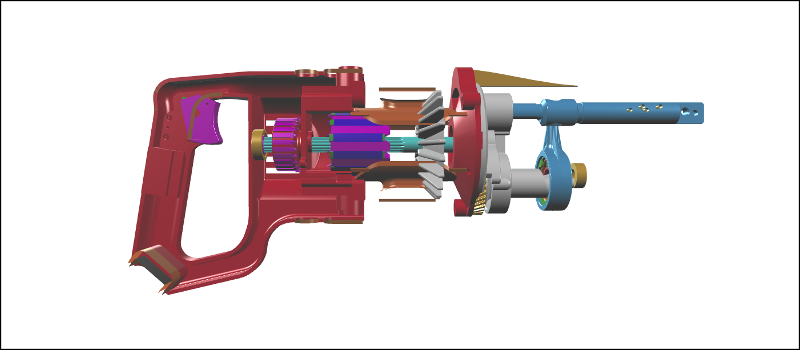

# Visibility

You can independently show and hide each object in your viewer.

### Example

[](http://xeolabs.com/xeometry/examples/#guidebook_visibility)

### More examples

Show everything in a viewer:

```javascript
viewer.show();
```

Hide everything in a viewer:

```javascript
viewer.hide();
```

Show all objects within a model:

```javascript
viewer.show("saw");
```

Hide all objects within a model:

```javascript
viewer.hide("saw");
```

Show given objects:

```javascript
viewer.show(["saw#1", "saw#5"]);
```

Show all objects of the given types (see *[Assigning types to objects](assigningTypesToObjects.md)*):

```javascript
viewer.show(["IfcFlowController", "IfcFlowFitting"]);
```

Show a model and two objects:

```javascript
viewer.show(["saw", "saw#1", "saw#5"]);
```

Hide a model, two objects and all objects of the given type:

```javascript
viewer.hide(["saw", "saw#1", "saw#5", "IfcFlowFitting"]);
```


